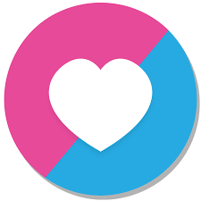

# FlappyBird

&nbsp;

&nbsp;

This repository contains source code of the Flappy Bird game.

Flappy Bird is a game developed by Dong Nguyen that went viral in 2013, utilizing a very simple but effective gameplay mechanic of avoiding pipes indefinitely by just tapping the screen or using space key making the player's bird avatar flap its wings and move upwards slightly. When the bird collides either with the obstacles which are pipes in this case or with the ground, the game gets over.

Scoring Criteria :

1: Earn Gold Medal by scoring 20+ points.

2: Earn Silver Medal by scoring 10+ points.

3: Earn Bronze Medal by scoring less than 10 points.

I have developed this game using LOVE2D gaming framework (version 0.10.2) with Lua as the scripting language.

&nbsp;

&nbsp;

For running this game you will need to install LOVE2D (version 0.10) on your system. [Click here to download LOVE2D](https://bitbucket.org/rude/love/downloads/).

&nbsp;

&nbsp;

You will also need to setup Lua in your system. [Download Lua from this link](https://sourceforge.net/projects/luabinaries/files/5.2.4/Tools%20Executables/lua-5.2.4_Win64_bin.zip/download?use_mirror=excellmedia).

For Visual Studio Code, install the following extensions :

> vscode-lua - [Click here to download](https://marketplace.visualstudio.com/items?itemName=trixnz.vscode-lua).

> Lua Debug - [Click here to download](https://marketplace.visualstudio.com/items?itemName=actboy168.lua-debug).

> LOVE2D Support [Click here to download](https://marketplace.visualstudio.com/items?itemName=pixelbyte-studios.pixelbyte-love2d).

LOVE2D Support by Pixelbyte Studios extension allows us to run the love application directly through Visual Studio Code by a simple shortcut : Left-Alt + L.

External Libraries Used : 

>[push.lua](https://github.com/Ulydev/push) - push library allows us to draw our game at a virtual resolution, regardless of however large our window is. Basically, it is used to provide a more retro look and feel to the game.

>[class.lua](https://github.com/vrld/hump/blob/master/class.lua) - class library allows us to represent anything in our game as code, rather than keeping track of many disparate variables and methods. Basically, it is used to utilize the concepts of Object Oriented Programming.

You can have a look at the demo video. [Click here](https://youtu.be/SSVEr3wN5DA).